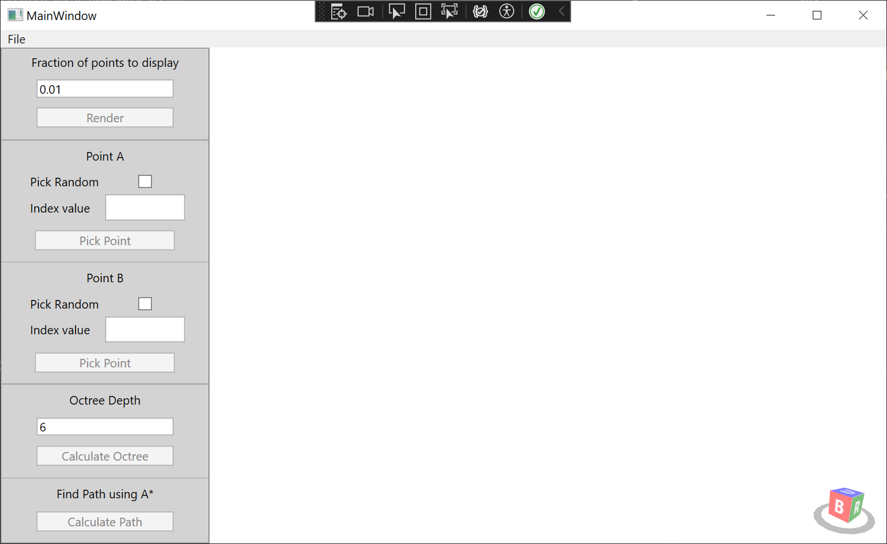
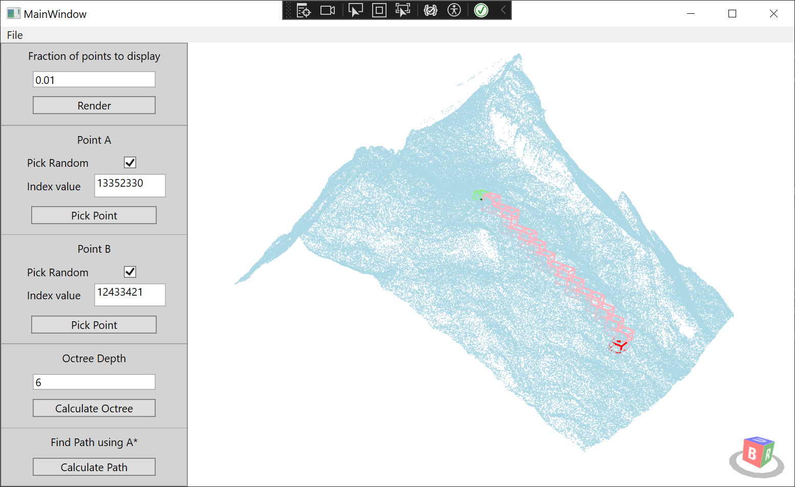

# Point Cloud Traversal in WPF
## Project Description
This is a project created as a homework assignment. This is the original task:
> Your task is to write a program that subdivides the provided point cloud using Octree and plans a path in the Octree from point A to point B. For path planning use A* algorithm.

The assignment came with a sample point cloud file that can be found [here](https://drive.google.com/file/d/1LgWT31UbIbYiZAT4_v_PoDKKQg5P7Mua/view?usp=sharing).
## Why WPF?
WPF project type was chosen for this task because the task required not to use any AI tools for development. I had some experience with WPF and also wanted to get more practice with it so this is why this project type was chosen. 

It is definitely not ideal for this type of application. The initial point cloud has more that 20 million points and trying to render all of them in WPF is just not possible due to either WPF limitations or lack of better knowledge about 3D graphics from my side.

The application works fine with 1% of the total points (around 200.000 points) but anything higher than that makes the application either unresponsive or slow or it crashes all together.

Despite the current solution not being able to render all the points, it uses all the points when calculating Octree structure.
## Usage
As this project is created using WPF that means that it is a Windows application which needs Windows operating system to run. You can download the build exe file from [here](Build/PointCloudTraversal.exe) or build it yourself using Visual Studio or other ways. Below you can find a screenshot of the application and explanation of how to use it:

As you can see from the screenshot all the buttons are disabled when the program is loaded. Now let's look at the steps of how this program should be used:

1. Load a file (.las files are supported)
2. After the file is loaded, the `Render` button should become active
3. After rendering the point cloud `Calculate Octree` button should become active
4. After calculating the octree `Calculate Path` button should become active (Points A and B have to be picked before clicking this button or an error will be shown)

It is possible to let the program pick random points for points A and B or index can be specified for each of them. When picking a random points its index is filled in the appropriate field.

It is possible to change how many points are being rendered but be warned providing a higher value might result in the application crashing.

It is also possible to change the octree depth. At depth of 6 the program is still quite responsive as well as at depth of 7 but the higher the depth the longer the calculations will take and the application might also crash if it runs out of memory.

If all the steps are done successfully a path from point A to point B should be displayed as octree nodes:

It is possible to move the camera around the point cloud (zoom, pan, tilt).
## Know Issues
Some of the issues have already been discussed but let's try to list all of them in a single location:
* Poor performance with many points
* Poor performance with high octree depth
* No visual indicators when a calculation is in progress
* Initial camera position is hardcoded for the sample file
* Code could be better organized
* Code is probably not efficient

There are probably more issues that have not been identified but I think that these are the main ones.

## References
As for this project it was not allowed to use any AI tools, some sources on the internet came to be very useful:
* [Changing camera direction in WPF with HelixToolkit (StackOverflow)](https://stackoverflow.com/questions/73358747/how-can-i-change-default-camera-direction-in-wpf-helix-toolkit)
* [Displaying point cloud in WPF using HelixToolkit (StackOverflow)](https://stackoverflow.com/questions/30545764/displaying-ply-point-cloud-in-c-sharp-using-helix-toolkit)
* [Generating random numbers without repetitions (StackExchange)](https://codereview.stackexchange.com/questions/61338/generate-random-numbers-without-repetitions)
* [IEnumerable and yield return (Blog)](https://stackoverflow.blog/2022/06/15/c-ienumerable-yield-return-and-lazy-evaluation/)
* [Determine if point is inside of a cube (StackOverflow)](https://stackoverflow.com/questions/21037241/how-to-determine-a-point-is-inside-or-outside-a-cube/21037466#21037466)
* [Remove items in hashset present in another hashset (Blog)](https://www.educative.io/answers/how-to-remove-items-in-hashset-present-in-a-specified-collection)
* [A* algorithm (YouTube)](https://www.youtube.com/watch?v=-L-WgKMFuhE)
* [WPF dialog box (Microsoft Documentation)](https://learn.microsoft.com/en-us/dotnet/desktop/wpf/windows/how-to-open-common-system-dialog-box?view=netdesktop-7.0)
* [WPF grid layout (Blog)](https://www.c-sharpcorner.com/UploadFile/1e050f/grid-layout-in-wpf/)
* [Reading las file (Github Documentation)](https://github.com/shintadono/laszip.net/blob/master/Examples/TestLasZipCS/Program.cs)